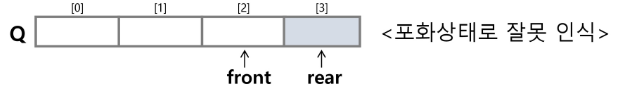

# Queue
- 선입선출구조(FIFO) <-> 스택: 선입선출(LIFO)
- 삽입: enqueue
- 삭제: dequeue

- queue 사용을 위해 필요한 연산
  - queue_init: front == rear == -1
  - isempty: 초기상태 >> front == rear == -1
  - isfull: rear == queue의 마지막 인덱스
  - enqueue: rear가 뒤로 움직임
  - dequeue: front가 뒤로 움직임

- enqueue
```py
def enqueue(item)
    global rear
    # push랑 달리 먼저 증가시키지 않는다

    # 1단계: full 확인
    if(isFull() == True):
        print('queue is full')
    
    # 2단계: enqueue
    else:
        rear += 1
        queue[rear] = item

# 또는
rear += 1
queue[rear] = item
```

- dequeue
```py
def dequeue():
    global front

    if(isEmpty() == True):
        print('queue is empty')

    else:
        front += 1
        return queue[front]

# 또는
front += 1
item = queue[front]
```

- 공백상태, 포화상태
```py
def isEmpty():
    # 공백: front == rear
    return front == rear

def isFull():
    # 포화: rear == 마지막 인덱스
    return rear == len(queue) - 1
```

## 원형 큐
- 선형큐는 포화상태 오류가 날 수 있다
  - 반복해서 enqueue, dequeue를 함
  - 둘 다 뒤로 이동하기 때문에 앞에 공간이 있더라도 더이상 자료 저장이 안됨.
  

- 해결법1: 연산을 할 때마다 원소를 앞으로 밀착
  - 근데 원소가 많으면 시간소요 증가

- 해결법2: 원형 큐
  - 1차원 배열을 사용하되 끝에 도달하면 다시 앞으로 이동하감

- 초기 공백상태: front == rear == 0
- index 순환: % 이용
- front 자리는 비워놓는다
- enqueue: (rear + 1) % N
- dequeue: (front + 1) % N

```py
def queue_init():
    global front
    global rear
    global N

    queue = [0] * N
    # 시작지점 == 0
    front = 0
    rear = 0

def isEmpty():
    # 공백상태: front == rear
    return front == rear

def isFull():
    # 포화상태: rear의 다음 위치 == 현재 front
    return (rear+1) % N == front

def enqueue(item):
    global rear
    global N

    # 꽉 찼다면 불가능
    if(isFull() == True):
        print('Full')

    # 삽입
    else:
        rear = (rear+1) % N
        queue[rear] = item

def dequeue():
    global front
    golbal N

    if(isEmpty() == True):
        print('empty')

    else:
        front = (front + 1) % N
        return queue[front]
```

## Linked list를 이용한 queue
- queue의 원소: linked list의 노드
- front: 첫 번째 노드의 주소
- rear: 마지막 노드의 주소

## deque(덱)
- 양 끝에서 추가, 삭제가 가능한 리스트류 컨테이너
- append(x): 오른쪽에 x 추가
- popleft(): 왼쪽에서 요소를 제거하고 반환

## Priority Queue
- FIFO가 아닌 우선순위가 높은 순서대로 나가게 된다

## Buffer
- 데이터를 다른 곳으로 전달할 때 일시적으로 데이터를 보관하는 메모리 영역
- queue를 이용해서 잠시 데이터 저장