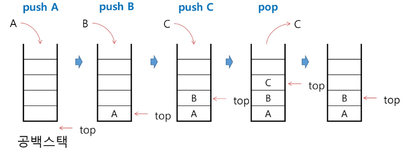

# Stack
## 스택의 특징
- 후입선출(LIFO)
- top: 마지막에 삽입된 원소의 위치
- 연산: **push, pop(읽고 아래로 내려감)**
- 추가기능: isEmpty, peek(그냥 읽기)
- stack의 삽입/삭제 과정
  
  - 보통 top == -1일 때 empty
  - top == size일 때 full(고점 뚫고 올라갔을 때)

- push 구현
```C
//global parameter
int top = -1;
int size = 10
int stack[size];

void push(int item, int size)
{
    top += 1;

    if(top == size)
        printf("overflow!");

    else
        stack[top] = item;
}

int main()
{
    //방법1: push함수
    push(10, size);

    //방법2: 단순 코드
    top += 1;
    stack[top] = 20;
    
}
```

- pop 구현
```C
//global parameter
int top;
int size = 10
int stack[size];

int pop()
{

    if(top == -1)
        printf("underflow!");
        return 0;

    else
    {
        top -= 1;
        return stack[top+1];
    }
}

int main()
{
    //방법1: pop함수
    int num = pop();

    //방법2: 단순 코드
    top -= 1;
    num = stack[top+1];
    
}
```
- 코드를 보면 알겠지만 push하고 pop을 하면 데이터가 삭제되는게 아니라 그냥 아래로 내려감
- 대신 나중에 다시 push를 하면 데이터가 바뀜
```c
/*
1 (1 push)
1 2 (2 push)
1 2, x=2 (pop)
1 2, x=1 (pop)
3 2 (3 push)
3 4 (4 push)
*/
```

## 재귀호출
- 본인을 다시 부르는 함수
- 인자에는 현재 상태와 목표가 있다
- 말보다는 예로 먼저 보자
```c
int fibo(int n):
{
    if(n < 2):
        return n;
    
    else:
        return fibo(n-1) + fibo(n-2);
}
```

- 재귀호출로 i번째 원소부터 맨 끝 까지 접근하기
```c
int f(i, N)
{
    if(i == N)
        return -1;

    else
    {
        printf('%d', arr[i]);
        f(i+1, N);
    }
}
```