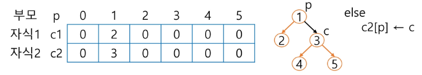
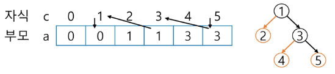

# 트리
- 비선형구조
- 1:N 자료구조

## 용어 정리
### 노드
- 노드: 트리의 원소
- 간선: 부모-자식 연결하는 선
- 루트노드: 트리의 시작점
- 형제노드: 부모가 같은 노드들
- 조상노드: 간선을 따라 루트까지 연결
- 서브트리: 부모노드와 연결된 간선을 끊었을 때 생기는 트리
- 자손노드: 서브 트리 하위 레벨 노드들

### 차수
- 노드의 차수: 노드에 연결된 자식의 수
- 트리의 차수: 노드의 차수 중에 가장 큰 값
- 단말노드(leaf): 차수가 0 == 자식이 없다

### 높이 == 레벨
- 노드의 높이: 루트에서 노드 까지 간선 수
- 트리의 높이: 노드의 높이 중 가장 큰 값

## Binary Tree
- 모든 노드가 2개 이하의 서브 트리를 가짐
- 최대 자식 2마리

- 레벨i에서 같은 레벨 노드의 최대 개수는 2^i 개
- 높이가 h면
  - 최소 노드 수: h + 1
  - 최대 노드 수: 2^(h+1) - 1

- 포화 이진트리: 모든 레벨에 노드가 가득 차있다
  - 최대 노드 수인 2^(h+1) - 1 개의 노드 존재

- 완전 이진트리: 빈 자리가 없는 이진 트리
- 편향 이진트리: 한 쪽으로만 자식이 있는 트리

# 순회
## 전위 순회(preorder traversal)
- 현재 > 왼쪽 > 오른쪽
```py
def preorder_traverse(T):
    if T:
        # 현재 방문
        visit(T)
        # 왼쪽 방문
        preorder_traverse(T.left)
        # 오른쪽 방문
        preorder_traverse(T.right)
```

## 중위 순회(inorder traversal)
- 왼쪽 > 현재 > 오른쪽
```py
def preorder_traverse(T):
    if T:
        # 왼쪽 방문
        preorder_traverse(T.left)
        # 현재 방문
        visit(T)
        # 오른쪽 방문
        preorder_traverse(T.right)
```

## 후위 순회(postorder traversal)
- 왼쪽 > 오른쪽 > 현재
```py
def preorder_traverse(T):
    if T:
        # 왼쪽 방문
        preorder_traverse(T.left)
        # 오른쪽 방문
        preorder_traverse(T.right)
        # 현재 방문
        visit(T)
```
# 이진트리 표현
## 배열을 이용한 이진트리
- 포화/완전 이진트리에 적합
- 노드 번호가 i
  - 부모: i/2
  - 왼쪽 자식: 2*i
  - 오른쪽 자식: 2*i+1
  - level n의 노드 시작 번호: 2^n

## 참고
- 부모번호를 인덱스로 자식을 저장


- 자식 번호를 인덱스로 부모를 저장


- linked list 사용
  - left: 왼쪽 자식 주소
  - 데이터
  - right: 오른쪽 자식 주소

- 수식 트리
  - 피연산자: 모두 leaf 노드
  - 연산자: 그 외 노드
  - 중위 순회: 중위 표기법
  - 후위 순회: 후위 표기법
  - 전위 순회: 전위 표기법