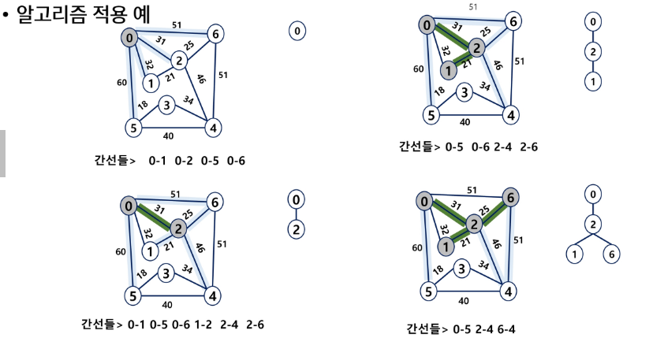
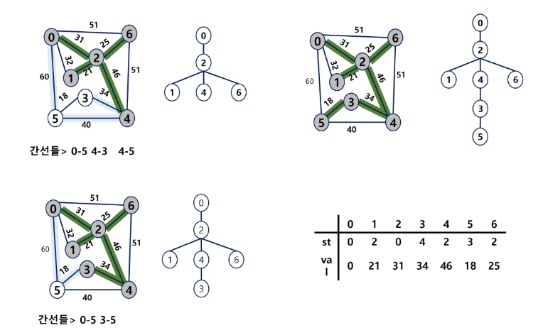
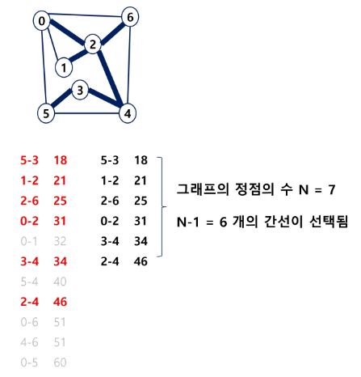

# MST
- 모든 정점을 연결하는 간선들의 가중치 합이 최소
- 신장트리: 싸이클이 있는 그래프 >> 싸이클 제거
- 최소신장트리: 가중치 합이 가장 작은 트리

- 인접행렬에 연결상태와 가중치를 기록한다
```py
   1  2  3  4  5
   -------------
1| 0  a  b  c  0
2| a  0  d  0  e
3| b  d  0  0  0
4| c  0  0  0  f
5| 0  e  0  f  0
```

## MST 알고리즘
- Kruscal: 간선 위주
- Prim: 노드 위주

## Prim 알고리즘
- priority queue 사용한 BFS(heap 트리)
- 시간복잡도: O((V+E) logV)
  - 정점이 많을 수록 느림

1. 임의의 노드 선택
2. 다른 노드로 이동하며 가장 최소의 가중치 선택




## Kruskal 알고리즘
- union find 사용
- 시간복잡도: O(E logE)
  - 간선 위주로 정렬 >> 간선이 많을수록 bad

1. 모든 간선의 가중치를 오름차순 정렬
2. 가장 낮은 간선부터 선택
3. 싸이클이 존재하면 스킵(union find)
4. N-1개의 간선이 선택되면 끝

