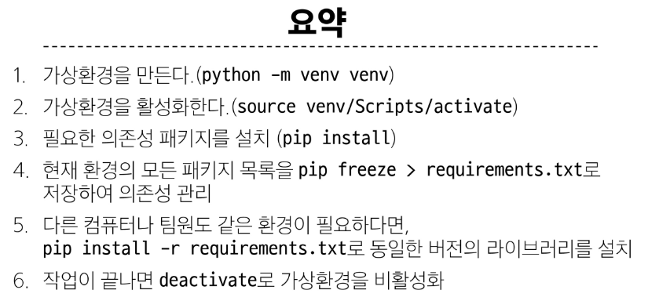

# Web 구조
- client <-> front-end <-> backend


# 가상환경
- 하나의 컴퓨터에서 또 다른 독립된 파이썬 환경
- 서로 다른 패키지 버전을 사용할 때 필요
- 서로 다른 패키지가 충돌이 일어날 때 사용


## 가상환경 생성
- global 환경에서 벗어난 환경

`python -m venv(가상환경 생성) venv(가상환경 이름)`
- 현재 디렉토리에 venv 폴더 생성(무조건 venv이름 사용)

`source venv/Scripts/activate`
- 가상환경 활성화: (venv) 표시되면 성공

`deactivate`
- 다시 기본 global 파이썬 환경으로 돌아옴


## 의존성
- 프로젝트가 실행되기 위해 꼭 필요한 패키지

`pip list`
- 현재 가상환경에 설치된 라이브러리 목록

`pip freeze > requirements.txt`
- 가상환경에 설치된 모든 패키지 기록
- 팀원이 똑같이 다운 받으면 된다

`pip install -r requirements.txt`
- requirements.txt에 기록된 패키지와 버전을 그대로 설치


## 가상환경 주의사항
- 사용할 python 환경을 on/off 하는 개념
  - 새 터미널 창을 열면 다시 활성화 해야 함

- venv는 gitignore에 작성되어 공유되지 않음


## 요약



# Django 프로젝트
1. `pip install django`
2. `pip freeze > requirements.txt`
3. 프로젝트 생성: `django-admin startproject firstpjt(프로젝트이름) .`
4. 서버실행: `python manage.py runserver`


## 디자인 패턴
- 애플리케이션 구조를 설계하는 일반적인 해결책


### MTV 디자인 패턴
- Django project: 애플리케이션의 집합
- Django application: 독립적으로 작동하는 기능 모듈
- 프로젝트(네이버 카페) <-> 앱(댓글, 게시글 ...)

- 앱을 사용하기 위한 순서
  1. 앱생성: `python manage.py startapp articles(이름)`
  2. 앱등록: 프로젝트 > settings > INSTALLED_APPS > 맨 앞에 앱 이름 등록


### 프로젝트 구조
- **제일 중요한 두 가지**
  1. settings.py
  2. urls.py

- 나머지는 참고
  - _ _ init.py _ _
  - asgi.py
  - wsgi.py
  - manage.py


### 앱 구조
- 중요한 것
  - admin.py
  - M: models.py
  - V: **view.py**: http 요청 처리, 응답

- 참고
  - apps. py
  - test.py


## Django의 요청, 응답

1. urls.py 작성
2. views.py 작성
3. templates 작성

- 예시
  1. urls.py에 있는 어떤 주소 작성 (admin/)
    - url 맨 뒤는 항상 /로 끝나야 한다
  2. apps에서 views.py에 index 함수 생성(렌더링)
  3. apps 내부에 template, articles 생성
  4. index.html 생성
  5. 서버가 응답 > 관리자 페이지 이동(로그를 남긴다)

- 요약
1. urls.py에서 각 url 경로는 반드시 /로 끝남
2. views.py에서 모든 view 함수의 첫 번째 인자는 request
3. Django는 특정 경로에 있는 template 파일만 읽어온다
  - app폴더/templates/


## MVC 패턴
- Model: 데이터와 관련된 로직
- View 템플릿에 데이터를 넣어서 응답(html page)를 만들어서 클라이언트에 보냄
- Controller: 클라이언트로부터 오는 요청 처리(게시글, 로그인, 댓글 ...)
  1. Model에 보여주고 싶은 데이터 저장(저장된 게시글에 대한 데이터)
  2. viw에게 이 모델을 만들어라(view 호출)
  3. view는 주어진 모델과 템플릿을 가지고 응답 html을 만들어서 클라이언트에게 보냄


# 전체 흐름 요약
1. 가상환경 생성
  - mkdir project1
  - 가상환경 다운: python -m venv venv
  - 가상환경 on: source venv/Scripts/activate
  - 설치된 라이브러리 확인: pip list
  - 장고 받기: pip install django
  - 설치된 라이브러리 기록: pip freeze > requirements.txt
  - 누군가의 프로젝트를 받는경우: pip install -r requirements.txt

2. .gitignore 생성
  - touch .gitignore
  - gitignore.io에서 Django 검색하고 복붙

3. Django 프로젝트 생성
  - django-admin startproject (이름) .
  ```
  fisrtpjt(루트 폴더: 프로젝트의 모든 것)
  > venv
  > firstpjt(django 프로젝트와 관련된 스크립트만 저장)
    > settings.py, urls.py ... 파이썬 패키지 모듈 생성
  > .gitignore
  > manage.py
  > requirements.txt
  ```

4. 서버 실행
  - 루트 폴더에서 python manage.py runserver

5. 앱 생성, 등록
  - python manage.py startapp (articles)
    - apps.py, views.py... 파이썬 패키지 생성됨

  - 장고프로젝트폴더 > settings.py > INSTALLED_APP에 등록
  ```py
  INSTALLED_APPS = [
    'articles', # 우리가 만든 앱
    'django.contrib.admin',
    'django.contrib.auth',
    'django.contrib.contenttypes',
    'django.contrib.sessions',
    'django.contrib.messages',
    'django.contrib.staticfiles',
  ]
  ```

6. 작동하는 앱 만들기
  - articles/templates 폴더 만들고 그 안에 index.html 생성
  - articles/vies.py에서 뷰 반환하는 함수 만들기
    - 사용자에게 보여질 html 파일로 응답페이지 생성

7. 앱 모듈 불러오기
  - django 프로젝트 폴더에서 urls.py에 index 경우 등록
  - 만약 index/로 온다면 index 함수로 view 반환
  ```py
  from articles import views

  urlpatterns = [
      path('admin/', admin.site.urls),
      path('index/', views.index),
  ]
  ```


