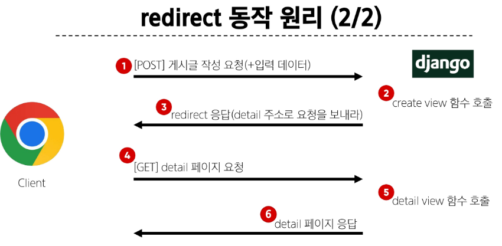

## 단일 게시글 조회
1. urls.py에서 특정 값에 대한 view함수 경로를 설정
```py
urlpatterns = [
    # pk변수에 대한 경로
    path('int:<pk>/', views.detail, name='detail'),
]
```
2. DB에서 데이터를 받아 views.py에 전달한다
```py
# 특정 단일 게시글의 상세 페이지를 응답
def detail(request, pk):
    # pk로 들엉온 정수 값을 활용해 DB에 id가 pk인 게시글 조회
    article = Article.objects.get(pk=pk)
    context = {
        'article': article
    }
    return render(request, 'articles/detail.html', context)
```

3. detailhtml 에서 변수를 사용한다
```django
  
    <p>글 번호: {{ article.pk }}</p>
    <a href=""></a>
    <p>글 제목: {{ article.title }}</p>
    <p>글 내용: {{ article.content }}</p>
    <hr>
  
```

# Create
1. urls.py 경로 설정
2. views.py에서 함수 설정
```py
# 사용자로부터 데이터를 받아 저장하고
# 저장이 완료되었다는 페이지를 제공하는 함수
def create(request):
    # 사용자로 부터 받은 데이터 추출
    title = request.GET.get('title')
    content = request.GET.get('content')
    
    # DB에 저장 요청
    # 1번 방법
    article = Article()
    article.title = title
    article.content = content
    article.save()
    
    # 2번 방법
    article = Article(title=title, content=content)
    article.save()
    
    # 3번 방법
    Article.objects.create(title=title, content=content)
    
    return render(request, 'articles/create.html')
```

## HTTP request method
- 클라이언트가 웹 서버에 특정 동작을 요청
- GET, POST

### GET
- 데이터 전송: C -> S
- 데이터 제한: 적은 양
- 브라우저 히스토리: 기록 남음
- 캐싱: 가능
- 검색 쿼리 전송, 웹페이지 요청, api에서 데이터 조회할 때 사용

### POST
- 데이터 전송: C -> S
- 데이터 제한: 많은 양
- 브라우저 히스토리: 기록 안남음
- 캐싱: 불가능
- 로그인, 파일 업로드, 새 데이터 생성, API에서 데이터 변경요청할 때 사용

### POST, GET 용도
- GET: 데이터 조회
- POST: 데이터 생성, 수정

## HTTP response status code
- 서버가 클라이언트 요청을 처리한 결과에 대한 3자리 숫자
- 처리 결과, 디버깅, 제어에 good

### CSRF Token
- 보안 강화 방법
- POST 메서드 사용시에 사용
- form tag에서 DTL의 csrf_token 태그 사용
```django
<form ~~>
  
```

## Redirect
- 데이터 저장 후 페이지를 응답하는 것이 아닌 사용자를 적절한 페이지로 보낸다.
- 사용자가 GET 요청을 보내게 만들어서 해당 페이지로 옮긴다

- redirect(): 클라이언트가 인자에 작성된 주소로 다시 요청을 보냄
- view함수 변경: render 대신 redirect 사용
`return redirect('articles:detail', article.pk)`



# Delete
- 데이터 조작: POST 사용 >> csrf_token도 사용
- redirect 사용: 지우고 나서 적절한 페이지로 옮긴다
```py
def delete(request, pk):
    # 삭제할 데이터 조회
    article = Article.objects.get(pk=pk)
    # DB에 삭제 요청
    article.delete()
    return redirect()
```

# Update
- 