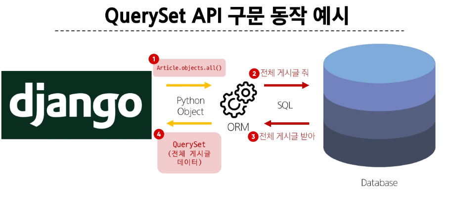

# ORM
- 객체 지행 언어를 사용하여 서로 다른 유형의 시스템간 데이터를 변환



- Python(django) <-> ORM <-> SQL(DB)


## QuerySet API 구문
- (model class).(manager).(query set API)
`Article.objects.all()`

- CRUD
  - create(저장)
  - read(조회)
  - update(갱신)
  - delete(삭제)

## 준비 과정
1. 유틸 기능 받기(자동완성 ... )
  - `pip install ipython django-extensions`

2. settings.py에 등록
    ```py
    INSTALLED_APPS = [
        # 직접 생성한 앱
        'articles',
        # 설치한 앱
        'django_extensions',
        # 내장 앱
    ]
    ```

3. mirate도 해줘야 함
  - `python manage.py migrate`

4. requirements.txt 업데이트
  - `pip freeze > requirements.txt`

5. Django shell 실행
  - `python manage.py shell_plus`


## Create
### 첫 번째 방법
1. class에서 객체 생성
  - 뒤에 코드만 치며 됨
  - `In [1]: article = Article()`

2. 원하는 내용 적기
  - `article.title = 'first'`
  - `article.content = django`

3. **내용 저장하기**
  - 내용을 저장하지 않으면 DB에 안올라감
  - `article.save()`

### 두 번째 방법
1. 한 줄에 생성 가능
  - `article = Article(title='second', content='djdj')`

2. 저장
  - `article.save()`

3. 쿼리셋 확인
  - `Article.objects.all()`


### 세 번째 방법
1. 저장 후 바로 데이터가 반환됨
  - 인스턴스를 생성한건 아님
  - `Article.objects.create(title='third',content='ddjj')`

- 그 외
  - `article.id`: 장고 말고 다른데서는 id 사용
  - `article.pk`: DB의 primary key: 장고에서 많이 씀
  - save()를 해야 pk든 id든 존재함

## Read(조회)
- all()
  - 전체 데이터 조회
  - `Article.objects.all()`
  - 출력: 쿼리셋
    - <QuerySet [<Article: Article object (1)>, <Article: Article object (2)>, <Article: Article object (3)>]>

- filter()
  - 매개변수와 일치하는 객체를 포함하는 QuerySet 반환 
  - `Article.objects.filter(content = 'django!')`
  - 출력: 쿼리셋
    - <QuerySet [<Article: Article object (1)>]>
    - 빈 쿼리셋도 반환함

- get()
  - 매개변수와 일치하는 객체를 반환
  - `Article.objects.get(pk=1)`
  - 출력: 객체
    -  <Article: Article object (1)>

  - 매개변수가 존재하지 않는 경우
    - 출력: DoesNotExist: ~~ >> 에러

  - 매개변수가 동일한 여러 객체가 존재하는 경우(content나 title이 동일)
    - 출력: MultipleObjectsReturned: ~~ >> 에러

  - **get 결론: primary key에만 사용해라**


## Update(수정)
1. 수정할 인스턴스를 찾는다
  - `article = Article.objects.get(pk=1)`

2. 인스턴스 변수를 변경
  - `article.title = 'bye'`

3. 저장
  - `article.save()`

4. 확인
  - `article.title` >> 'bye'

## Delete(삭제)
1. 삭제할 객체를 찾는다
  - `article = Article.objects.get(pk=2)`

2. delete() 메서드 이용: 삭제하고 반환해줌
  - `article.delete()`

3. 더 이상 조회 불가능
  - `Article.objects.get(pk=2)` >> 에러
  - 지운 pk 값은 재활용하지 않는다

# ORM with views.py
- views.py에서 클래스를 호출하여 사용한다
```py
from .models import Articles

def index(request):
  articles = Articles.objects.all()
  context = {
    'articles': articles
  }
  return render(request, 'articles/index.html', context)
```

- shell_plus에서도 파이썬 문법 적용 가능
```shell
In [1]: book = Book.objects.all()

In [2]: for item in book:
   ...:     print(item.title)
   ...:
```