# CSS Box Model
- content: 컨텐츠가 표시되는 영역
  - width와 height를 사용해서 조절
- padding: 컨텐츠 주위 공백 영역
- border: padding을 감싸는 테두리
- margin: 박스와 다른 요소 사이의 공백 영역

- top, bottom, left, right로 공백 조절
```css
<!DOCTYPE html>
<html lang="en">

<head>
  <meta charset="UTF-8">
  <meta name="viewport" content="width=device-width, initial-scale=1.0">
  <title>Document</title>
  <style>
    .box1 {
      width: 200px;
      padding-left: 25px;
      padding-bottom: 25px;
      margin-left: 25px;
      margin-top: 50px;
      border-width: 3px;
      border-style: solid;
      border-color: black;
    }

    .box2 {
      width: 200px;
      border: 1px dashed black;
      margin: 25px auto;
      padding: 25px 50px;
    }
  </style>
</head>

<body>
  <div class="box1">box1</div>
  <div class="box2">box2</div>
</body>

</html>
```

## shorthand 속성
- border-width, syle, color를 한 번에 설정하기 위한 속성
- margin, padding: 4 방향의 속성을 한 번에 지정
```css
/* border */
/* 서로 다른 요소 작성 순서는 영향 없다*/
border: 2px solid black;

/* margin, padding */
/* 4개 - 상우하좌 */
margin(padding): 1px 2px 3px 4px;

/* 3개 - 상/좌우/하 */
margin(padding): 1px 2px 3px;

/* 2개 - 상하/좌우 */
margin(padding) 1px 2px;

/* 1개 - 전부 */
margin(padding): 1px
```

## box sizing 속성
- 표준 상자 모델에서 w,h 속성 값을 설정하면 content box의 크기를 조정한다
- 실제 박스 크기는 테두리, 패딩 값을 모두 더해서 좀 더 커짐

- 대체상자 모델을 사용하면 content가 아닌 border의 크기를 조절한다
```css
<!DOCTYPE html>
<html lang="en">

<head>
  <meta charset="UTF-8">
  <meta name="viewport" content="width=device-width, initial-scale=1.0">
  <title>Document</title>
  <style>
    .box {
      width: 100px;
      border: 2px solid black;
      padding: 10px;
      margin: 20px;
      background-color: yellow;
    }
    /* 박스의 크기: margin 제외하고 나머지 */
    /* 전체 witdh: 100 + 2x2 + 10x2 */
    .content-box {
      box-sizing: content-box;
    }

    /* 전체 witdh: 100 + 2x2 + 10x2 */
    /* content: 100 - 2x2 - 10x2 = 76 */
    .border-box {
      box-sizing: border-box;
    }
  </style>
</head>

<body>
  <div class="box content-box">content-box</div>
  <div class="box border-box">border-box</div>
</body>

</html>
```
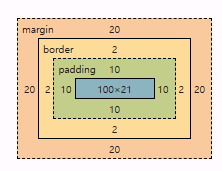
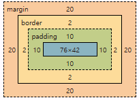


## 기타 display 속성
- inline-block
  - width와 height 속성 사용 가능
  - padding, margin 및 border로 인해 다른 요소가 상자에서 밀려남
  - 새로운 행으로 넘어가지 않음

  - 요소가 줄 바꿈 되는 것을 원하지 않으면서 너비와 높이를 적용하고 싶은 경우에 사용
```css
<!DOCTYPE html>
<html lang="en">

<head>
  <meta charset="UTF-8">

  <meta name="viewport" content="width=device-width, initial-scale=1.0">
  <title>Document</title>
  <style>
    span {
      margin: 20px;
      padding: 20px;
      width: 80px;
      height: 50px;
      background-color: lightblue;
      border: 2px solid blue;
      display: inline-block;
    }

    ul>li {
      background-color: crimson;
      padding: 10px 20px;
      display: inline-block;
    }

    .container {
      text-align: center;
    }

    .box {
      width: 100px;
      height: 100px;
      background-color: #4CAF50;
      margin: 10px;
      display: inline-block;
    }
  </style>
</head>

<body>
  /* <!-- 1. 이제 다른 요소를 밀어낼 수 있는 span --> */
  <p>Lorem ipsum dolor sit amet <span>consectetur</span> adipisicing elit. Animi iusto enim officia exercitationem
    dolorque, quasi velit, dolores, tempora illum odio necessitatibus. Fugit,
    cumque eligendi!</p>

  /* <!-- 2. 리스트 요소를 가로로 정렬 --> */
  <ul>
    <li><a href="#">link</a></li>
    <li><a href="#">link</a></li>
    <li><a href="#">link</a></li>
  </ul>

  /* <!-- 3. div 요소를 가로로 정렬 --> */
  /* inline box가 아니였다면 세로로 정렬됨 */
  <div class="container">
    <div class="box"></div>
    <div class="box"></div>
    <div class="box"></div>
  </div>
</body>

</html>
```
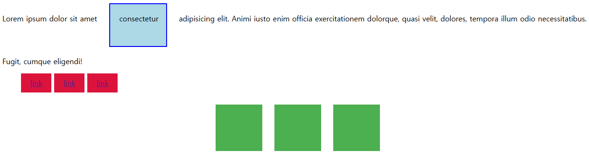


- none
  - 요소를 화면에 표시하지 않고, 공간도 부여하지 않음
  - visibility hidden: 보이지는 않지만 공간은 부여됨
```css
<!DOCTYPE html>
<html lang="en">

<head>
  <meta charset="UTF-8">
  <meta name="viewport" content="width=device-width, initial-scale=1.0">
  <title>Document</title>
  <style>
    .box {
      width: 100px;
      height: 100px;
      background-color: red;
      border: 2px solid black;
    }
    /* none: 보이지도 않고, 공간도 없다 */
    .none {
      display: none;
    }
  </style>
</head>

<body>
  <div class="box"></div>
  /* 여기서 none으로 분류된다 >> 2개의 박스만 보임*/
  <div class="box none"></div>
  <div class="box"></div>
</body>

</html>
```
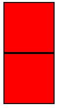


# CSS Position
- Normal Flow에서 제거하여 다른 위치로 배치
- 법선 활용: top, bottom, left, right, z

## Position 유형
- static: 요소를 normal flow에 따라 배치
  - top, right, bottom, left 속성이 적용되지 않음
  - 기본 값

- relative: 본인의 원래 위치(static)에 대한 상대적 위치
  - top, bottom, left, right로 원래 위치에서 수정
  - 다른 요소의 레이아웃에 영향 X
  - 본인의 원래 위치에는 아무도 오지 못한다.

- absolute: 요소를 normal flow에서 제거
  - 가장 가까운 relative 부모 요소를 기준으로 이동
    - 부모 요소가 없다면 body를 기준으로 함
  - 요소가 차지하는 공간이 없어짐
  - 유튜브 썸네일에 재생 같은거
  

- fixed: 현재 화면에 고정. 웹툰의 리모컨 같은 거
  - 요소가 차지하는 공간이 없어짐
  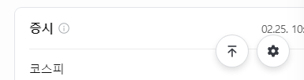

- sticky
  - relative + fixed
  - 스크롤 위치가 임계점에 도달하기 전에는 relative처럼 동작
  - 스크롤이 특정 임계점에 도달하면 화면에 고정됨
    - 다른 sticky를 만나거나, 부모를 벗어나기 전 까지
  - VScode에서 코드 길어지면 위에 고정되는 것과 비슷함

```css
<!DOCTYPE html>
<html>

<head>
  <meta charset="UTF-8">
  <meta name="viewport" content="width=device-width, initial-scale=1.0">
  <title>Document</title>
  <style>
  /* 박스 크기 기준: content X, border O */
    * {
      box-sizing: border-box;
    }

    body {
      height: 1500px;
    }

    .container {
      position: relative;
      height: 300px;
      width: 300px;
      border: 1px solid black;
    }

    .box {
      height: 100px;
      width: 100px;
      border: 1px solid black;
    }

    .static {
      /* position: static; */
      /* 별 다른 top, left 지정을 못해서 가장 첫 번째 구석에 생성됨 */
      background-color: lightcoral;
      /* 이거 써도 의미 없음 */
      top: 50px;
      right: 50px;
    }

    /* 부모 요소(여기서는 box)를 기준으로 배치됨 */
    .absolute {
      position: absolute;
      background-color: lightgreen;
      top: 100px;
      left: 100px;
    }
    
    /* 자신의 원래 위치에 박스를 배치했고,
       거기서 top, left만큼 평행이동 */
    .relative {
      position: relative;
      background-color: lightblue;
      top: 100px;
      left: 100px;
    }

    /* 현재 화면 기준으로 배치된다: 맨 위 오른쪽 끝 */
    .fixed {
      position: fixed;
      background-color: gray;
      top: 0;
      right: 0;
    }
  </style>
</head>

<body>
  <div class="container">
    /* 요소를 부모에 맞춰서 배치한다. 위치 조정이 안된다 */
    <div class="box static">Static</div>
    /* absolute의 부모는 box임. 없었다면 body가 부모가 됨 */
    <div class="box absolute">Absolute</div>
    /* 부모: box, box에서 자신의 원래 위치(static) 기준으로 이동*/
    <div class="box relative">Relative</div>
    /* 현재 화면이 기준이라 부모가 있어도 필요 없음 */
    <div class="box fixed">Fixed</div>
  </div>
</body>

</html>
```
```css
<!DOCTYPE html>
<html lang="en">

<head>
  <meta charset="UTF-8">
  <meta name="viewport" content="width=device-width, initial-scale=1.0">
  <title>Document</title>
  <style>
    body {
      height: 15000px;
    }

    .sticky {
      position: sticky;
      top: 0;
      background-color: lightblue;
      padding: 20px;
      border: 2px solid black;
    }
  </style>
</head>

<body>
  <h1>Sticky positioning</h1>
  <div>
    <div class="body sticky">첫 번째 Sticky</div>
    <div>
      <p>내용1</p>
      <p>내용2</p>
      <p>내용3</p>
    </div>
    <div class="body sticky">두 번째 Sticky</div>
    <div>
      <p>내용4</p>
      <p>내용5</p>
      <p>내용6</p>
    </div>
    <div class="body sticky">세 번째 Sticky</div>
    <div>
      <p>내용7</p>
      <p>내용8</p>
      <p>내용9</p>
    </div>
  </div>
</body>

</html>
```

## z - index
- 요소의 쌓임 순서를 정의
- 부모 요소의 z index 값에 영향 받는다
  - 흙수저: 본인의 index가 커도 부모가 낮음
  - 같은 부모에서 z index 비교
  - 클 수록 가장 위에 있다. (다른 애들 가림)

```css
<!DOCTYPE html>
<html lang="en">

<head>
  <meta charset="UTF-8">
  <meta name="viewport" content="width=device-width, initial-scale=1.0">
  <title>Document</title>
  <style>
    .container {
      position: relative;
    }

    .box {
      position: absolute;
      width: 100px;
      height: 100px;
    }
    /* z인덱스가 가장 높은 빨강이가 맨 위 */
    .red {
      background-color: red;
      top: 50px;
      left: 50px;
      z-index: 3;
    }

    .green {
      background-color: green;
      top: 100px;
      left: 100px;
      z-index: 2;
    }
    /* 가장 낮은 파랭이가 맨 아래 */
    .blue {
      background-color: blue;
      top: 150px;
      left: 150px;
      z-index: 1;
    }
  </style>
</head>

<body>
  <div class="container">
    <div class="box red">z-index: 3</div>
    <div class="box green">z-index: 2</div>
    <div class="box blue">z-index: 1</div>
  </div>
</body>

</html>

```
# Inner display type
- 박스 내부 요소들이 어떻게 배치될 지 결정
## Flexbox
### Flexbox 요소
- **main axis**
  - flex item들이 배치되는 기본 축
  - main start -> main end

- cross axis
  - main axis에 수직
  - cross start -> cross end

- Flex Container
  - display: flex 또는 inline-flex가 설정된 부모요소
  - Flex item: flex container 내부에 레이아웃됨

### Flexbox 속성
- 기본적으로 행(위에서 아래)으로 나열
- 주 축의 시작 선에서 시작
  - `flex-direction: column(-reverse)/row(-reverse);` >> 주 축의 방향이 변경된다

- flex-wrap: 넘어가면 다른 행으로 배치함
 `flex-wrap: wrap;`

 - `justify-content: center/start/end;` >> 가운데 정렬, 좌로 정렬, 우로 정렬

 - `align-content/item/self: center/start/end` >> wrap이 적용된 여러 행에 적용됨(한 줄 짜리는 효과 없음)

 - 정리
   - 배치: flex-direction, wrap
   - 공간 분배: justify-content, align-content
   - 정렬: align-items, self

```css
<!DOCTYPE html>
<html lang="en">

<head>
  <meta charset="UTF-8">
  <meta name="viewport" content="width=device-width, initial-scale=1.0">
  <title>Document</title>
  <style>
    .container {
      height: 500px;
      border: 1px solid black;
      display: flex;
      /* 기본 방향은 위에서 아래 > row
      그 외에 설정할 수 있다. */
      flex-direction: row;
      flex-direction: column;
      flex-direction: row-reverse;
      flex-direction: column-reverse;

      /* wrap: flex 아이템 목록이
       한 행에 들어가지 않을 경우
       다른 행에 배치한다 */
      /* 기본적으로 no wrap */
      flex-wrap: nowrap;
      flex-wrap: wrap;

      /* flex item을 container에서 정렬한다 */
      /* 기본적으로 flex-start */
      justify-content: flex-start;
      justify-content: center;
      justify-content: flex-end;

      /* wrap되어 있을 때, 여러 행으로 item이 분배되었을 때 적용됨 */
      /* item과 주위 공간을 정렬시켜준다고 보면 된다 */
      align-content: flex-start;
      align-content: center;
      align-content: flex-end;

      /* item만 정렬시켜준다고 보면 된다 */
      align-items: flex-start;
      align-items: center;
      align-items: flex-end;
    }

    .post {
      background-color: grey;
      border: 1px solid black;
      margin: 0.5rem;
      padding: 0.5rem;
    }
    /* align-self: 자신만을 정렬 */
    .item1 {
      align-self: center;
    }

    .item2 {
      align-self: flex-end;
    }
  </style>
</head>

<body>
  <div class="container">
    <div class="post item1">
      <h2>Post Title 1</h2>
      <p>Post Content 1</p>
    </div>
    <div class="post item2">
      <h2>Post Title 2</h2>
      <p>Post Content 2</p>
    </div>
    <div class="post item3">
      <h2>Post Title 3</h2>
      <p>Post Content 3</p>
    </div>
    <div class="post item4">
      <h2>Post Title 4</h2>
      <p>Post Content 4</p>
    </div>
  </div>

</body>

</html>
```

- 요약: justify: 주 축을 따라 ~, align: 교차 축을 따라 ~

- `flex-grow` >> 남는 행 여백을 비율에 따라 item에 분배(1 1 0 2) == (+1 +1 +0 +2)를 기본 공간에 더 주는거임. <-> 'flex-shrink'
```css
<!DOCTYPE html>
<html lang="en">

<head>
  <meta charset="UTF-8">
  <meta name="viewport" content="width=device-width, initial-scale=1.0">
  <title>Document</title>
  <style>
    .container {
      display: flex;
      width: 100%;
    }

    .item {
      height: 100px;
      color: white;
      font-size: 3rem;
    }

    .item-1 {
      background-color: red;
      flex-grow: 1;
    }

    .item-2 {
      background-color: green;
      flex-grow: 2;
    }

    .item-3 {
      background-color: blue;
      flex-grow: 3;
    }
  </style>
</head>

<body>
  <div class="container">
    <div class="item item-1">1</div>
    <div class="item item-2">2</div>
    <div class="item item-3">3</div>
  </div>
</body>

</html>

```
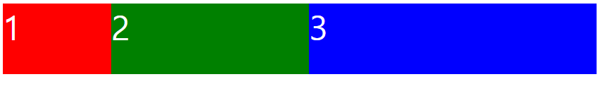


- `flex-basis` >> flex item의 초기 크기를 지정
```css
<!DOCTYPE html>
<html lang="en">

<head>
  <meta charset="UTF-8">
  <meta name="viewport" content="width=device-width, initial-scale=1.0">
  <title>Document</title>
  <style>
    .container {
      display: flex;
      width: 100%;
    }

    .item {
      height: 100px;
      color: white;
      font-size: 3rem;
    }

    .item-1 {
      background-color: red;
      flex-basis: 300px;
    }

    .item-2 {
      background-color: green;
      flex-basis: 600px;
    }

    .item-3 {
      background-color: blue;
      flex-basis: 300px;
    }
  </style>
</head>

<body>
  <div class="container">
    <div class="item item-1">1</div>
    <div class="item item-2">2</div>
    <div class="item item-3">3</div>
  </div>
</body>

</html>
```
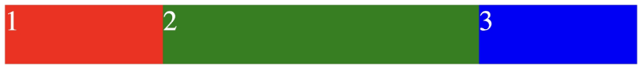


# 내가 생각하는 요약
```CSS
1. head에 style 만들기
<style>
</style>

2. 배경이 될 컨테이너 만들기
여기서 display를 조정할 수 있다.
flex, inline-box, none
<style>
  .container{
      display: flex;
      flex-direction: column;
      justify-content: center;
      text-align: center;
      margin: 20px;
  }
</style>

3. 세부 내용물 만들기
여기서 박스 배경 색, margin, padding, position 타입을 결정할 수 있다.
static, absolute, relative, sticky, fixed
<style>
  .container{
      display: flex;
      flex-direction: column;
      justify-content: center;
      text-align: center;
      margin: 20px;
  }

  .static-example{
      background-color: lightgray;
      margin: 10px;
      padding: 20px;
      position: static;
      color: white
  }
  ...

</style>
```

# 진짜 요약
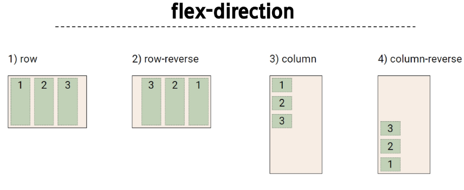
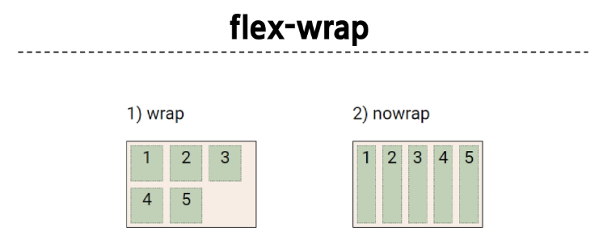
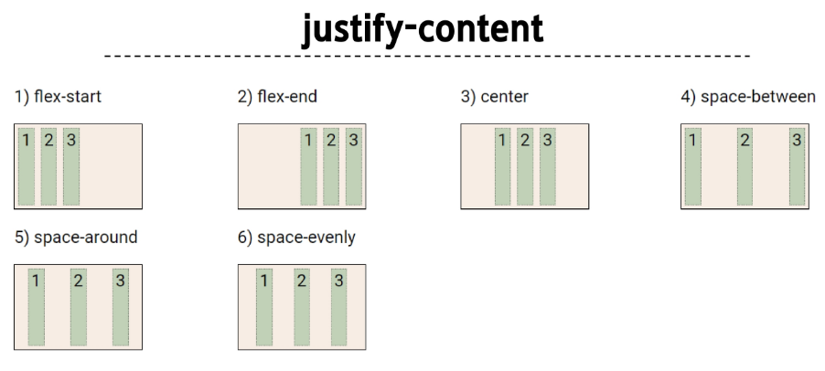
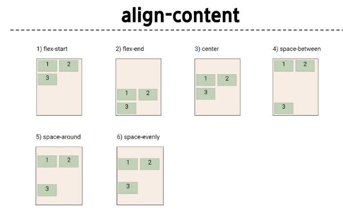
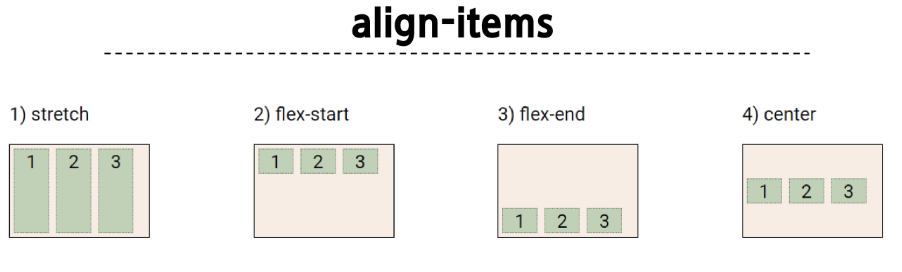
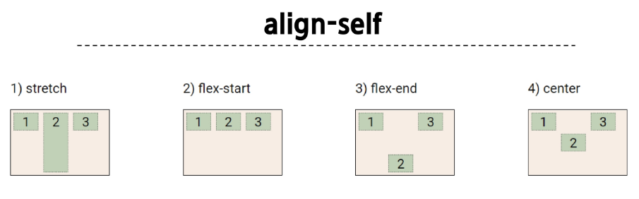