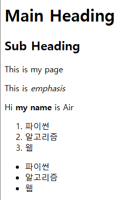
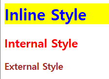
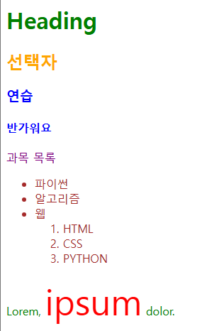
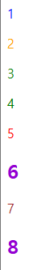
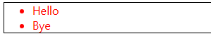
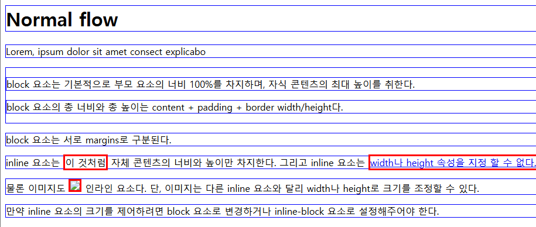

# HTML 구조
- `<!DOCTYPE html>`
  - 해당 문서가 html로 문서라는 것을 나타냄

- `<html></html>`
  - 전체 페이지의 컨텐츠를 포함

- `<title></title>`
  - 브라우저 탭 및 즐겨찾기 시 표시되는 제목

- `<head></head>`
  - HTML문서에 관한 설명, 설정
  - 사용자에게 보이지 않음

- `<body></body>`
  - HTML 문서의 내용을 나타냄
  - 페이지에 표시되는 컨텐츠 작성
  - 하나의 body 요소만 존재

- HTML element
  - `<opening tag> content </closing tag>`
  - 이게 element

- HTML Attributes
  - 목적에 따른 추가 기능
  - `<p class="editor-note"> content </p>`
  - class에 해당하는 부분이 attributes

## HTML Text structure
- 웹 페이지의 의미와 구조를 정의한다
- heading, paragraphs
  - h1~6, p
  - 제목 혹은 본문인을 나타낸다

- lists
  - ol
    1. 숫자
    2. 순서

  - ul
    * 내용
    * 순서

  - li: ol 혹은 ul 내용물의 시작, 끝을 알림
```css
<ol>
  <li>파이썬</li>
  <li>알고리즘</li>
  <li>웹</li>
</ol>
<ul>
  <li>파이썬</li>
  <li>알고리즘</li>
  <li>웹</li>
</ul>
```

    

- emphasis, importance
  - em, strong

# CSS
- 웹의 디자인, 레이아웃
```css
<head>
  <meta charset="UTF-8">
  <meta name="viewport" content="width=device-width, initial-scale=1.0">
  <title>Document</title>

  /* 외부 스타일: 헤드에서 링크에 연결 */
  <link rel="stylesheet" href="style.css">

  /* 내부 스타일: 헤드에서 스타일 작성 */
  <style>
    h2 {
      color: red;
    }
  </style>
</head>

<body>
  /* 기본적으로 바디에서 요소를 선언한다
     그 후 스타일에 따라 꾸미는 장소가 달라지는 거임 */

  /* 인라인 스타일: body 요소 안에 작성 */
  <h1 style="color:blue; background-color: yellow;">Inline Style</h1>

  /* 내부 스타일: 바디에서 선언하고 */
  <h2>Internal Style</h2>

  /* 외부 스타일: 별도의 css 파일 생성해서 사용 */
  <h3>External Style</h3>
</body>
```



## CSS Selector
- html 요소를 선택하여 스타일을 적용하게 한다
```css
<head>
  <meta charset="UTF-8">
  <meta name="viewport" content="width=device-width, initial-scale=1.0">
  <title>Document</title>
  <style>
    /* 전체 선택자 */
    * {
      color: red;
    }
    /* 타입 선택자 */
    h2 {
      color: orange;
    }

    h3, 
    h4 {
      color: blue;
    }
    /* class 선택자 */
    .green {
      color: green;
    }
    /* id 선택자 */
    #purple {
      color: purple;
    }

    /* green 클래스의 자식 결합자: 첫 번째 자식만 공유 */
    .green > span {
      font-size: 50px;
    }

    /* green 클래스의 자손 결합자: 모든 자손들과 공유 */
    .green li {
      color: brown;
    }

  </style>
</head>

<body>
  /* 클래스 색깔 따라감 */
  <h1 class="green">Heading</h1>
  /* 선언된 타입 선택자 따라감 */
  <h2>선택자</h2>
  <h3>연습</h3>
  <h4>반가워요</h4>
  /* 아이디 선택자 따라감 */
  <p id="purple">과목 목록</p>
  /* green 이라는 클래스 생성 */
  <ul class="green">
    /* green 클래스의 li 상속을 따라감 */
    <li>파이썬</li>
    <li>알고리즘</li>
    <li>웹
      <ol>
        <li>HTML</li>
        <li>CSS</li>
        <li>PYTHON</li>
      </ol>
    </li>
  </ul>
  /* green의 형제 클래스, span은 폰트 사이즈는 지정되어있지만 
  색깔은 지정이 안되어 있어서 전체 기본 색깔인 빨강을 따라감 */
  <p class="green">Lorem, <span>ipsum</span> dolor.</p>
</body>
```



## 명시도
- 요소에 적용할 CSS 선언을 결정하는 알고리즘
- importance > inline > id 선택자 > class 선택자 > element 선택자 > 소스코드 선언 순서
- 궁금했던 점
  - 태그(h, p)는 클래스에 속함
  - id는 한 element에 일대일 대응
  - 클래스는 여러 element에 사용 가능
```css
<head>
  <meta charset="UTF-8">
  <meta name="viewport" content="width=device-width, initial-scale=1.0">
  <title>Document</title>
  <style>
    h2 {
      color: darkviolet !important;
    }

    p {
      color: blue;
    }

    .orange {
      color: orange;
    }

    .green {
      color: green;
    }

    #red {
      color: red;
    }
  </style>
</head>

<body>
  /* p가 선언되었으니까 그거 따라감 */
  <p>1</p>
  /* p가 선언되었지만, 클래스가 우선임 */
  <p class="orange">2</p>
  /* green과 orange 중에 green이 더 나중에 선언되어서 green 따라감 */
  <p class="green orange">3</p>
  <p class="orange green">4</p>

  /* 클래스와 아이디 중에 아이디가 우선 */
  <p id="red1" class="orange">5</p>
  /* 그냥 important */
  <h2 id="red2" class="orange">6</h2>
  /* 클래스 < 아이디 < 인라인 */
  <p id="red3" class="orange" style="color: brown;">7</p>
  /* 클래스 < 아이디 < 인라인 < important */
  <h2 id="red4" class="orange" style="color: brown;">8</h2>
</body>
```



## CSS 상속
- 상속O: text 요소(font, color, text-align, visibility 등)
- 상속X: box 요소, position 요소
```css
<head>
  <meta charset="UTF-8">
  <meta name="viewport" content="width=device-width, initial-scale=1.0">
  <title>Document</title>
  <style>
    .parent {
      /* 상속 O */
      color: red;

      /* 상속 X */
      border: 1px solid black;
    }
  </style>
</head>

<body>
  <ul class="parent">
    /* parent 속성을 상속받음: 빨강O, borderX */
    <li class="">Hello</li>
    <li class="">Bye</li>
  </ul>
</body>
```

- 상속받았다면 hello와 bye도 까만 상자를 가져야 함


## CSS Box Model
- 웹페이지의 모든 html 요소를 감싸는 사각형 상자
- 원은 네모 박스를 깎음

### Outer display type
- 문서 흐름에서 박스가 어떻게 동작하는 지 결정

- 타입이 이미 정해져 있다.
- Block box
  - 대표 태그: h, p, div
  - width, height 사용
  - padding, margin, border로 다른 요소를 상자에서 밀어냄

- Inline box
  - 대표 태그: a, img, span, strong, em
  - 새로운 행으로 넘어가지 않는다
  - width, height 사용 못함
  - padding, margin, border 적용 되지만 다른 요소를 밀어낼 수 (수직: 없다 / 수평: 있다)

```css
<head>
  <meta charset="UTF-8">
  <meta name="viewport" content="width=device-width, initial-scale=1.0">
  <title>Document</title>
  <style>
    /* 인라인 박스의 스타일 */
    a,
    span,
    img {
      border: 3px solid red;
    }

    /* 블락 박스의 스타일 */
    h1,
    p,
    div {
      border: 1px solid blue;
    }
  </style>
</head>

<body>
  <h1>Norma flow</h1>
  <p>Lorem, ipsum dolor sit amet consect explicabo</p>
  <div>
    <p>block 요소는 기본적으로 부모 요소의 너비 100%를 차지하며, 자식 콘텐츠의 최대 높이를 취한다.</p>
    <p>block 요소의 총 너비와 총 높이는 content + padding + border width/height다.</p>
  </div>
  <p>block 요소는 서로 margins로 구분된다.</p>
  <p>inline 요소는 <span>이 것처럼</span> 자체 콘텐츠의 너비와 높이만 차지한다.
    그리고 inline 요소는 <a href="#">width나 height 속성을 지정 할 수 없다.</a>
  </p>
  <p>
    물론 이미지도  인라인 요소다.
    단, 이미지는 다른 inline 요소와 달리 width나 height로 크기를 조정할 수 있다.
  </p>
  <p>
    만약 inline 요소의 크기를 제어하려면 block 요소로 변경하거나 inline-block 요소로 설정해주어야 한다.
  </p>
</body>
```


### Inner display type
- 박스 내부 요소들이 어떻게 배치될 지 결정
- flex