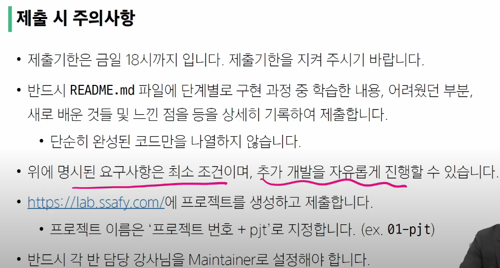

# 실습목표
## 웹 브라우저를 켜서 URI에 접속
- 웹 브라우저처럼 python으로 요청을 보낼 수 없나?
- request 라이브러리 사용

```py
import requests

#요청주소
URL = 'https://fakestoreapi.com/carts'

#.get(URL): URL 주소에 요청을 보내는 메서드
data = requests.get(URL)
print(data)

#<출력 결과: Response [200]>
# [200]: 웹의 응답 코드 -> 정상 응답
# [404]: 비정상 응답

#실제 데이터 구조 확인
json_data = data.json()
print(json_data)

#예쁜 구조로 확인
from pprint import pprint as print
```

- 서버가 요청 해석 하는 법: API
  - (내 코드): 파이썬 <-> (API <-> data): 서버

- open API 주의사항
  - 너무 많은 서로 다른 계정에서 동시에 요청을 보내면 서버가 못견딤 >> 오픈 API는 API KEY를 활용하여 사용자 확인

  - 한 사용자가 여러 번 요청 >> 유료로 돌려버리면 됨

- json: API가 사용하는 데이터 형식
  - 경량의 텍스트 기반의 데이터 형식
  ```py
  import json

  # 파싱: 데이터를 의미 있는 구조로 분석, 해석
  # json 형식의 문자열을 파싱하여 dict로 변환
  json.load()
  ```

# 데이터 사이언스
- 정보를 추출하는 5단계
  1. 문제정의
  2. 데이터 수집
  3. 데이터 전처리
  4. **데이터 분석**
  5. 결과 해석 및 공유

- 파이썬에서 데이터 사이언스를 위한 패키지: Numpy, pandas, Matplotlib

# 도전과제
- 파이썬으로 날씨 데이터 수집
- 정기 예금 데이터 수집 및 미션 수행

## 정리
1. 서버 - 클라이언트 구조
2. API 개념 및 활용법
3. 파싱(list, dict)
4. 데이터 사이언스

