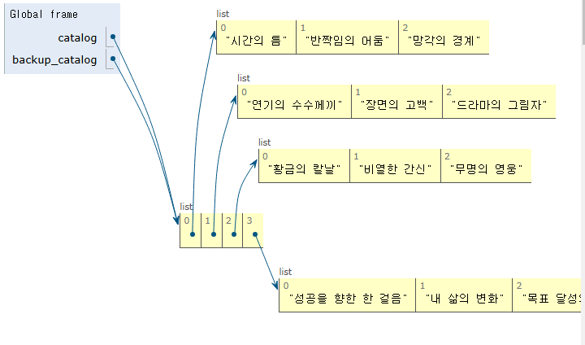
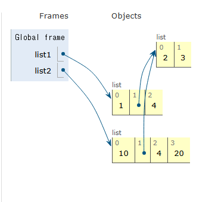
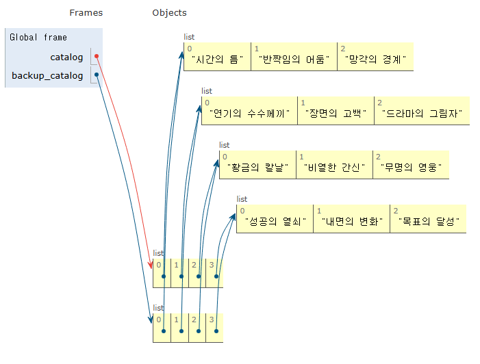

# Sequence

## 리스트
- 변경 가능한 자료형 (문자열은 불가능했는데)
  - 문자열은 메모리 자체에 문자열이 존재했음.
  - 리스트는 요소의 주소들이 존재함.

- 어떤 자료형도 섞어서 저장 가능
- 리스트의 인덱스도 문자열과 같다.
```python
mylist[0:5:2] # 2칸씩 건너뜀
mylist[::-1] # 거꾸로 출력

my_list = [1, 2, 3, 'Python', ['hello', 'world', '!!!']]
len(my_list) # 5
my_list[4][2] # !!!
my_list[4][1][0] # w
```

## 튜플
- **변경 불가능**, 소괄호로 표기
  - my_tuple = (1, '2', 3, 'b', 5)
  - my_tuple[0] = 'z' : 불가능

  - 요소가 하나밖에 없어도 뒤에 콤마 붙여야함
  ```python
  mytuple = (1) >> int 1
  mytuple = (1,) >> tuple 요소 1
  ```

  - 개발하면서는 잘 안쓰고 다중할당, 값 교환, 그룹화, 다중 반환 값 등에서 쓰임

## range
- 연속된 정수 시퀀스 생성, **변경 불가능**
```py
range(시작 값, 끝 값 제외, 증가 값)

range(5) # 0 ~ 4 까지 1씩 증가
range(n, m) # n ~ m-1 까지 1씩 증가
range(n, m, step) # n ~ m-1 까지 step만큼 증가
```
- 기본 증가 값은 1 / -1로 하면 역순 / 0은 에러
```py
range(5, 1, -1) # 감소하면 시작이 더 커야함
range(1, 5, -1) # [] 그냥 빈 리스트

range(1, 5, 2) # 증가하면 시작이 더 작아아야함
range(5, 1, 2) # [] 그냥 빈 리스트
```

# Non-sequence
## dict
- key-value 쌍으로 이루어짐
- 순서와 중복 없음 (넣은 순서는 구분함함)
- **변경 가능**

### 딕셔너리 표현
- key는 변경 불가능한 자료형만 사용 가능(변수 X)
```python
my_dict = {'key': 'value', 'list': [1, 2, 3]} # key를 통해 value를 사용
my_dict['key'] #'value'가 나옴

my_dict['banana'] = 30 # key banana와 value 30 추가
my_dict['key'] = 43 # key 값을 value에서 43으로 변경

my_dict['list'][1] # 2가 나옴
```

## set(집합 연산)
- 중복X 순서X (넣은 순서도 구분 안함)
```python
my_set_1 = set() # 초기화
my_set_2 = {1, 2, 3}
my_set_3 = {1, True, 1.0} # {1} 중복X, 값만 봄
my_set_3-1 = {True, 1.0, 1} # {True} 첫빠따 기준
my_set_3-2 = {1.0, True, 1} # 1.0
my_set_4 = {3, 1, 2} # {1, 2, 3}

my_set_1 | my_set_2 #합집합
my_set_1 - my_set_2 #1의 차집합
my_set_1 & my_set_2 #교집합
```

## None
- 값이 없음을 표현하는 자료형
- N이 대문자

## Boolean
- True / False

## 형변환
### 암시적 형변환
- 정수와 실수의 연산에서 정수가 실수로 변환됨
```python
3 + 5.0 # 8.0
True + 3 # 4
True + False # 1 
```

### 명시적 형변환
- 문자 <-> 숫자
```python
int('1') # 1
int('3.5') # error
int(3.5) # 3 내림

float('3.5') = 3.5

str(3) + '등' # '3등'
```

## 연산자
- 복합연산자
```python
a += b # a = a + b
a -= b # a = a - b
a *= b # a = a * b
a /= b # a = a / b
a %= b # a = a % b
a //= b # a = a // b
```

- 비교연산자: 값을 중심으로 본다
```py
is # 메모리주소까지 같아야함
is not # 메모리주소

== #겉모습이 같으면 같음
!= # 겉모습

2.0 == 2 # True
2.0 is 2 # False

a = [1, 2]
b = [1, 2]
a == b # True
a is b # False, 메모리 주소가 다르다
```

  - is는 언제쓰냐? >> 같은 주소에 있는지 확인할 때
    - None을 비교할 때
    - singleton 객체: 프로그램 전체에서 1개만 존재(None, True, False)

- 논리 연산자(and or not)
**앞에서부터 조건을 판단하고 뒤로 이어서 판단함**
  ```python
  vowels = 'aeiou'

  ('a' and 'b') in vowels # False: b와 vowels비교
  ('b' and 'a') in vowels # True: a와 vowels비교
  # a랑 b랑 둘 다 True여서 그냥 뒤에 값을 받은거

  3 and 5 # 5
  5 and 3 # 3
  3 and 0 # 0

  5 or 3 # 5: 5가 True이고 or면 무조건 True여서 끝
  3 or 5 # 3: 3이 True이고 or면 무조건 True여서 끝
  3 or 0 # 3
  ```

- 멤버십 연산자
```py
in # 왼쪽 피연산자가 오른쪽 피연산자에 있는지 확인
not in
```

## Deep copy, shallow copy
```python
#shallow copy
mylist = [1,[2,3]]
newlist = mylist.copy() #이거는 이중리스트 이상일 경우 문제 발생
newlist = mylist #이러면 같은 list를 포인팅함
```



```python
mylist = [1,2,3]
newlist = mylist.deepcopy() # 절대 문제 발생X
newlist = list(mylist) #이러면 새로운 리스트를 포인팅함
```

