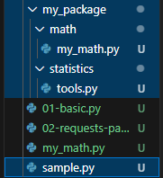

## 모듈
### 내장 모듈
- math
```py
import math # import문 사용
from math import sqrt #만약 from절을 사용하면

math.pi # 3.141592...
math.sqrt(4) # 2.0 > 루트
sqrt(4) #math. 제외가능
```

- as 키워드: 서로 다른 모듈이 같은 이름의 함수를 제공할 경우 충돌을 피함
```py
from math import sqrt
from math import sqrt as sq

sqrt(4)
sq(4)
```
- **그냥 import만 쓰는게 더 좋다**

### 사용자 정의 모듈
- 같은 경로내 py파일에서 정의된 함수를 가져와서 쓸 수 있다. >> 다른 경로면 경로 설정해줘야함
```py
#my_math.py
def add(x, y):
    return x+y

#다른 파일
import my_math

print(my_math.add(1,3))
```

## 표준 라이브러리
### 패키지
- 모듈을 폴더에 모아놓음

- sample과 package는 같은 경로
- package 안의 파이썬 함수를 사용하고 싶다면
```py
# 이 때 from과 . 으로 경로를 설정할 수 있다

#sample.py에서
from my_package.math import my_math
from my_package.statistics import tools

print(my_math.add(1,2))
print(tools.mod(1,2))
```

## 외부 패키지
- pip install ()
- pip uninstall ()

## 제어문
### 조건문
순차적으로 비교한다
```py
a = 2
if(a == 0) #이거 보고
elif(a == 1) #이것도 아니면
else #여기까지 가는거임
```

### 반복문
- for
  - 시퀀스 항목들을 순서대로 반복, 횟수가 중요
  ```py
  for 변수 in 반복 가능한 객체:
    코드
  ```
  - 반복 가능한 객체: 시퀀스는 당연하고 dict와 set도 반복 가능하다
  ```py
  #변수형 지을 때 복수형과 단수형으로 지으면 좋다

  #리스트 순회
  items = ['apple', 'banana', 'coconut']

  for item in items:
    print(item) # apple\n banana\n coconut\n

  #문자열 순회
  country = 'Korea'

  for char in country:
    print(char) # K\n o\n r\n e\n a\n

  #range 순회
  for i in range(0, 5):
    print(i)

  #딕셔너리 순회
  mydict = {'x':10, 'y':20, 'z':30}

  for key in mydict:
    print(key) #그냥 쓰면 key값이 나옴
    print(mydict[key]) #이렇게 해줘야 value가 나옴

  #인덱스로 리스트 순회
  items = ['apple', 'banana', 'coconut']

  for i in range(0, len(items)):
    print(items[i]) # apple\n banana\n coconut\n

  ```
- while문
  - 조건이 참인 동안 반복, 종료 조건이 중요

- 정리
  - for문
    - 반복 횟수가 정해져 있을 경우
    - 리스트, 튜플, 문자열 같은 시퀀스
  - while문 
    - 반복 횟수가 불명확 할 때
    - 조건을 받아서 충족할 때 까지

- 반복제어
  - break: 반복 중지
  - continue: 다음 반복으로 건너뜀
  - pass: 동작 안하고 넘어감(반복문 자체를 무시)
```py
for i in range(0, 10):
    if i == 5:
        break
    print(i) # 01234

    if i % 2 == 0:
        continue
    print(i) # 13579

    pass # 아무런 동작 안함

while True:
    if condition:
        break #루프 끝

    elif condition:
        pass #루프는 계속 진행

    else:
        print(1)
```

### List comprehension
```py
[표현식 for 변수 in iterable]
[표현식 for 변수 in iterable if 조건식]

# 기존 방식
numbers = [1, 2, 3, 4, 5]
squared_numbers = []

for num in numbers:
    squared_numbers.append(num**2)
#[1, 4, 9, 16, 25]

# List comprehension
squared_numbers = [num**2 for num in numbers]
#[1, 4, 9, 16, 25]

#2차원 배열 만들기
data1 = [[0]*(5) for _ in range(5)]
data2 = [[0 for _ in range(5) for _ in range(5)]]
```

### 모듈 내부 살피기
`help(math)`

### enumerate
- 인덱스와 요소를 같이 **튜플**로 뽑아내줌
```py
fruits = ['apple', 'banana', 'coconut']

#0부터 뽑아준다.
for index, fruit in enumerate(fruits):
    print(index, fruit)
    """
    0 apple
    1 banana
    2 coconut
    """

#3부터 뽑아준다.
for index, fruit in enumerate(fruits, 3):
    print(index, fruit)
    """
    3 apple
    4 banana
    5 coconut
    """
```

# 연습문제에서 깨달음
```py
#딕셔너리를 쓸 때 '와 "를 섞어서 써야 충돌이 안일어남
print(f"{diction['이름']}은/는 {diction['종류']}(이)다.")

#딕셔너리 리스트 순회 시 dict먼저 나오고 key가 나옴
dictList = [{}, {}]
for diction in dictList:
    # diction = {}
    for key in diction:
        # key = key
        # diction['key'] = value

#filter: userList에서 None을 모두 제거해줌
user_list = list(filter(None, user_list))
```