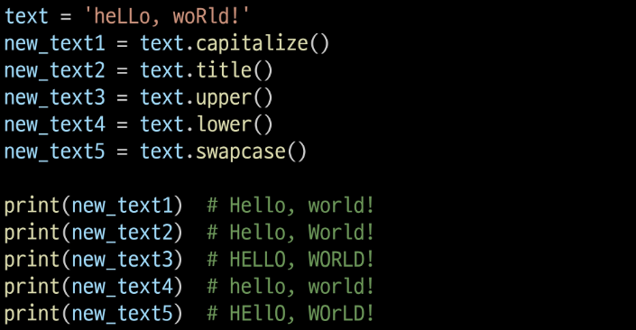

# What is method?
- class 내부에 정의되는 함수
- 객체의 상태를 바꿀 때 사용
- 지금까지 배운 str, list 등등 다 클래스임
- 클래스에 해당하는 메서드만 사용할 수 있음
```py
#함수
def add(a,b):
    return a+b

#클래스와 메서드
class Calculator:
    def add(self,a,b):
        return a+b
    
#함수호출
add(1,2)

#메서드 호출
a = Calculator() #Instance 생성
a.add(1,2)
```

# str method
## .find(x)
- x의 첫 위치 반환 / 없으면 -1
```py
'banana'.find(n) # 2
'banana'.find(z) #-1
```

## .index(x)
- x의 첫 위치 반환 / **없으면 Error(코드 중단)**
```py
'banana'.index(n) # 2
'banana'.index(z) # Value Error
```

## .isupper(), .islower()
- 문자열이 모두 대/소문자인지 확인
```py
'hi'.isupper() # False
'HI'.isupper() # True
'Hi'.isupper() # False

'hi'.islower() # True
'HI'.islower() # False
'Hi'.islower() # False
```

## .isalpha()
- 문자열이 알파벳만 있는지 확인
```py
'Hello'.isalpha() # True
'2Hi'.isalpha() # False
```

# 문자열 조작 메서드
- 기존 문자열을 바꾸는게 아니라 새로운 문자열 반환 >> 불변

## .replace(old, new [, count])
- old 글자를 new로 바꿈. count가 있다면 그 개수만큼. 원본을 바꾸지는 않는다.
```py
text = 'Hello world world world'

#'Hello Python Python Python'
text1 = text.replace('wolrd', 'Python')

#'Hello Python world world'
text2 = text.replace('wolrd', 'Python', 1)
```

## .strip([x])
- 지정한 문자 제거. 비어있다면 시작과 끝 공백 제거
```py
text = '    hi  '
text1 = text.strip() # 'hi'
```

## .split([x])
- x를 없애고 문자 분리. 없다면 공백 기준
```py
text = 'hi! hi'
text.split('!') # ['hi', 'hi']
text.split() #['hi!', 'hi']
```

## 'separator'.join(iterable)
- iterable 문자열을 'separtor'로 연결
```py
word1 = ['hi', 'bob']
word2 = ['hi', 1]

text1 = '-'.join(word1) # 'hi-bob'
text2 = '-'.join(word2) # Error: int
```

## 그 외
- .capitalize(): str의 제일 처음을 대문자
- .title(): str에서 단어 제일 처음을 대문자
- .upper(): 모두 대문자
- .lower(): 모두 소문자
- .swapcase(): 대소문자 반전


# List 메서드
- str과 달리 원본이 바뀜 >> 가변

## .append(x)
- 리스트의 마지막에 x 추가
```py
[1,2,3].append(4) # [1,2,3,4]

# None: 원본을 수정하기 때문
print([1,2,3].append(4))
```

## .extend(iterable)
- 리스트에 반복가능한 객체의 모든 항목 추가
- iterable이 리스트가 아니라 튜플, str도 가능
```py
mylist=[1,2]
mytuple=(3,4)
mylist.extend(mytuple)
print(mylist) #[1, 2, 3, 4]

mylist=[1,2]
mytuple='hi, hi'
mylist.extend(mytuple)
print(mylist)
#[1, 2, 'h', 'i', ',', ' ', 'h', 'i']
```

**append VS extend**
```py
#[1,2,3,[4,5,6]]
mylist.append([4,5,6]) # 맨 뒤에 []를 추가

#반복가능한 객체가 아니면 불가능
mylist.extend(100) # Error: not iterable
```

## .insert(i,x)
- i 위치에 x 삽입
```py
mylist = [1,2,3]
mylist.insert(1,5) #[1,5,2,3]
```

## .remove(x)
- 리스트에서 첫 번 째로 나오는 x 삭제
```py
mylist = [1,2,3,2,4]
mylist.remove(2) # [1,3,2,4]
```

## .pop(i)
- 리스트에서 i 인덱스의 항목을 제거하고 반환. 지정하지 않으면 마지막 항목이 default
```py
mylist = [1,2,3,4]
item1 = mylist.pop() # 4
item2 = mylist.pop(1) # 2
print(mylist) #[1,3]
```

## .clear()
- 리스트초기화
```py
mylist = [1,2,3]
mylist.clear() # []
```
## .index(x)
- 리스트에서 처음으로 나오는 x의 인덱스 반환
```py
mylist = [1,2,3,2]
index = mylist.index(2) # 1
```

## .count(x)
- 리스트에서 x의 개수 반환
```py
mylist = [1,2,1,3,1,4]
count = mylist.count(1) # 3
```

## .reverse()
- 지금 리스트를 뒤집음
```py
mylist = [1,3,4,2]
mylist.reverse() # [2,4,3,1]
```

## .sort([reverse=True])
- 지금 리스트를 오름차순/내림차순 정렬
```py
mylist = [1,100,2,99]
mylist.sort() #[1,2,99,100]
mylist.sort(reverse=True) #[100,99,2,1]
```

# 복사
- 가변객체: 생성 후 내용 변경 가능
  - 리스트, 딕셔너리, 집합
  - 객체의 내용이 변경되어도 같은 메모리 주소 유지

- 불변객체: 생성 후 배용 변경 불가능
  - 정수, 실수, 문자열, 튜플
  - 새로운 값을 할당하면 새로운 객체 생성

- 변수할당: '='로 객체의 메모리 주소를 가리킴
```py
#가변 객체
a = [1,2]
b = a #b와 a는 같은 메모리주소
b[0] = 100

a # [100,2]
b # [100,2]
a is b # True

#불변객체
a = 1
b = a
b = 2

a # 1
b # 2
a is b # False
```

## 얕은 복사(실제 메모리 주소는 서로 다르다)
- 리스트 슬라이싱
- copy()
- list
```py
a = [1,2,3]
b = a[:]
c = a.copy()

b[0] = 100
c[0] = 999
a #[1,2,3]
b #[100,2,3]
c #[999,2,3]
```
- 하지만 리스트 안에 가변객체가 또 있다면 문제 발생(예를들면 이중리스트)
```py
a = [1,2,3,[4,5]]
b = a.copy()

b[0] = 999
a #[1,2,3,[4,5]]
b #[999,2,3,[4,5]]

b[3][1] = 888
a #[1,2,3,[4,888]]
b #[999,2,3,[4,888]]

a[3] is b[3] # True
```

## 깊은 복사
```py
import copy

a = [1,2,[3,4,5]]
b = copy.deepcopy(a)
b[2][1] = 100

a #[1,2,[3,4,5]]
b #[1,2,[3,100,5]]
a[2] is b[2] # False
```

# 메서드 체이닝
- 반환 여부가 중요하다
```py
text = 'heLLo'
newtext1 = text.swapcase().replace('E', 'z')
# 'HEllO' >> 'HzllO'

listt = [1,2]
newlist1 = listt.append(3).extend([4,5])
# append는 원본에 추가하므로 리턴이 없다. 따라서 extend와 chaining이 안됨. 대표적으로 append(), sort()
```
**참고: 문자 유형 판단 메서드**
- 기본적으로 셋 다 숫자인지 판단함
- isdecimal(): 순수 0~9만
- isdigit(): 유니코드도 가능 ㉾ 이런  수도
- isnumeric(): isdigit보다 넓은 범위인데 걍 그렇다고 쳐

# 딕셔너리 메서드
## .clear()
```py
person = {'name': 'Alice', 'age': 25}
person.clear() # {}
```

## .get()
- 키와 연결된 값 반환. 없으면 None 혹은 default
```py
person = {'name': 'Alice', 'age': 25}
print(person.get('name'))
print(person.get('country')) # None
print(person.get('country', 'Unknown')) # Unknown
print(person['country'])  # KeyError: 'country'
```

## .keys()
- 키를 모은 객체를 반환
```py
person = {'name': 'Alice', 'age': 25}
print(person.keys())  # dict_keys(['name', 'age'])
for item in person.keys():
    print(item)
```

## .values()
- 값을 모은 객체를 반환
```py
person = {'name': 'Alice', 'age': 25}
print(person.values())  # dict_values(['Alice', 25])
for item in person.values():
    print(item)
```

## .items()
- 키/값 쌍을 모은 객체를 반환
```py
person = {'name': 'Alice', 'age': 25}
print(person.items())  # dict_items([('name', 'Alice'), ('age', 25)])
for key, value in person.items():
    print(key, value)
```

## pop()
- 키를 제거하고 연결된 값을 반환
```py
person = {'name': 'Alice', 'age': 25}
print(person.pop('age'))  # 25
print(person)  # {'name': 'Alice'}
print(person.pop('country', None))  # None
# print(person.pop('country'))  # KeyError: 'country'
```

## setdefault()
- 키와 연결된 값을 반환, 키가 없다면 default와 연결한 키를 딕셔너리에 추가하고 default 반환
```py
person = {'name': 'Alice', 'age': 25}
person.setdefault('country', 'KOREA') # KOREA
# {'name': 'Alice', 'age': 25, 'country': 'KOREA'}
```

## .upadate()
- other가 제공하는 키/값 쌍으로 딕셔너리 덮어 씀
```py
person = {'name': 'Alice', 'age': 25}
other_person = {'name': 'Jane', 'country': 'KOREA'}

person.update(other_person)
# {'name': 'Jane', 'age': 25, 'country': 'KOREA'}

person.update(age=100, address='SEOUL')
# {'name': 'Jane', 'age': 100, 'country': 'KOREA', 'address': 'SEOUL'}
```

# Set 메서드
## .add(x)
- 세트에 x 추가
```py
my_set = {'a', 'b', 'c', 1, 2, 3}
my_set.add(4) #{1, 2, 3, 4, 'c', 'a', 'b'}
my_set.add(4)# {1, 2, 3, 4, 'c', 'a', 'b'}
```

## .remove(x)
- 세트에서 x 제거. 없으면 에러
```py
my_set = {'a', 'b', 'c', 1, 2, 3}
my_set.remove(2) #{1, 3, 'c', 'a', 'b'}
my_set.remove(10) # KeyError: 10
```
## .discard(x)
- 세트에서 x 제거. 없어도 에러 안남
```py
my_set = {'a', 'b', 'c', 1, 2, 3}
my_set.discard(2) #{1, 3, 'c', 'a', 'b'}
my_set.discard(10) 
```
# 해시
- 원리
1. 키를 해시 함수를 통해 해시 값으로 변환
2. 변환된 해시 값을 인덱스로 삼아 데이터 저장/찾음

- 정수: 숫자 자기 자신이 해시값
- 문자열: 해시 난수화가 적용되어 실행할 때마다 다름

- hashable
  - 해시함수에 넣어 해시 값을 구할 수 있는 객체
  - 불변타입(int, str, tuple ...)은 가능
  - 가변타입(list, dict, set)는 불가능

---
## 연습문제에서 깨달음
```py
#문자열을 거꾸로 출력하기
reversedStr = ''.join(reversed(inputSrt))
#reversed는 그 자체로 클래스임. 즉, reversed class
print(reversed(inputSrt)) #reversed object at 0x000002340D1E4460: iterable함
''.join('위에꺼') # reversed object를 문자열마다''를 추가해서 연결해줌. 빈칸 없으니까 그대로 뒤집는거임.
```