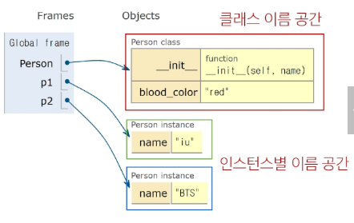

# OOP

## 절차지향 프로그래밍
- 데이터와 데이터의 함수가 분리됨
- 순차적인 명령어, 함수 호출의 흐름이 중요
- 복잡성, 유지보수 문제

## 객체지향 프로그래밍
- 데이터와 함수를 하나의 **객체**로 묶어서 관리

### 객체
- 속성(variable), 동작(method)를 묶은 것
- 데이터 + 데이터의 알고리즘
- 사용자 정의 객체를 만들려면
  1. 클래스를 만든다 (클래스 = 타입)
  2. 생성자를 호출해서 생성

### Class
- 파스칼케이스로 작성(MyClass)
- 객체를 만들어내기 위한 설계도

### Instance
- 클래스를 통해 생성된 객체
- 가수 클래스에서 아이유가 생성
- 아이유는 객체(O)
- 아이유는 인스턴스(△)
- 아이유는 가수의 인스턴스(O)

### 클래스 구성 요소
- 생성자 메서드
  - _ _ init _ _
  ```py
  class Person:
    # 초기화 메서드
    #개발자가 실제로 모듈 진행X
    #객체가 생성될 때 자동으로 초기화 시켜줌
    def __init__(self, name, age):
        self.name = name  # 인스턴스 속성
        self.age = age  # 인스턴스 속성

    def introduce(self):
        print(f'안녕하세요. 저는 {self.name}, 나이는 {self.age}살입니다.')
  ```
- 인스턴스 변수
  - self.변수명 형태로 정의
  - 다른 인스턴스끼리 공유 안됨


- 클래스 변수
  - 모든 인스턴스가 공유

``` py
class Circle:
    # 클래스변수
    pi = 3.14 

    #인스턴스변수
    def __init__(self, radius):
        self.radius = radius
```

### 클래스변수와 인스턴스변수
- 클래스 변수와 동일한 이름으로 인스턴스 변수 생성시 클래스 변수가 아닌 인스턴수 변수를 먼저 참조
```py
class Circle:
    pi = 3.14

    def __init__(self, radius):
        self.radius = radius


c1 = Circle(5)
c2 = Circle(10)

print(c1.radius)  # 5
print(c2.radius)  # 10

# c1의 인스턴스 변수 pi를 생성
c1.pi = 100

print(c1.pi)  #
print(Circle.pi)  #

# c2는 인스턴스 변수 pi가 없으므로 클래스 변수 pi를 참조
print(c2.pi)  #
```

### 메서드

#### 인스턴스 메서드
- 첫 번째 인자로 **무조건 인스턴스 자신(self)를 받음**
```py
'hello'.upper()

#객체지향적 동작
str.upper('hello')
```

#### 생성자 메서드
```py
class Person:
    def __init__(self, name):
        # 왼쪽 name : 인스턴스 변수 name
        # 오른쪽 name : 메서드의 매개변수
        self.name = name
        print('인스턴스가 생성되었습니다.')

    def greeting(self):
        #그냥 name만 쓰면 안됨
        #공유되고있는 인스턴스 변수를 선언해야함.
        print(f'안녕하세요 {self.name}입니다.')


person1 = Person('지민')  # 인스턴스가 생성되었습니다.
person1.greeting()  # 안녕하세요. 지민입니다.
# Person.greeting(person1)
```

#### 클래스 메서드
- @classmethod 데코레이터로 정의
- 호출 시, 첫 번째 인자로 **무조건 cls가 전달됨**
```py
class Person:
    # 클래스 변수
    population = 0

    def __init__(self, name):
        self.name = name
        #클래스 메서드를 사용하기 위해 앞에 Person을 적어서 cls에 넣어줄 수 있게 함
        Person.increase_population()

    #클래스 매서드 선언
    @classmethod
    def increase_population(cls):
        cls.population += 1


person1 = Person('Alice')
person2 = Person('Bob')
print(Person.population)  #2
#물론 클래스 메서드만 따로 쓸 수도 있다.
Person.increase_population()
```

#### 스태틱 메서드
- @staticmethod 데코레이터 사용
- 호출 시 전달받는 인자가 없음
- 인스턴스나 클래스 속성에 직접 접근X
- 단순 확인용도로 주로 사용됨
```py
# 수학함수는 그냥 더하거나 곱하게만 하면 되므로 인스턴스를 건드릴 필요가 없다.
class MathUtils:
    @staticmethod
    def add(a, b):
        return a+b

print(MathUtils.add(3, 5))  #8
```

#### 요약
- 클래스가 사용함
  - 클래스 메서드: 클래스변수 조작
  - 스태틱 매서드: 일반적인 기능 수행

- 인스턴스가 사용함
  - 인스턴스 메서드: 인스턴스 변수 조작

- 클래스와 인스턴스의 메모리
  - 파이썬에서는 클래스도 객체임
  - 클래스나 객체가 생성되면 변수와 메서드가 메모리 공간에 생성됨
  - 인스턴스는 각각 다른 메모리 공간에 생성됨



- 매직 메서드
  - _ _init _ _ 같이 언더바 2개 있는 메서드
  - 특정 상황에 자동으로 호출됨
  ```py
  class Circle:

      # 인스턴스 생성 시 반지름을 넣으면 자동으로 호출됨
      def __init__(self, radius):
        self.radius = radius

      # 인스턴스만 넣고 print하면 자동으로 문자열 반환해줌
      def __str__(self):
          return f'원의 반지름: {self.radius}'
  
  c1 = Circle(10)
  print(c1) #원의 반지름: 10
  ```