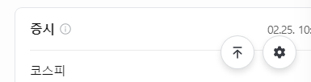

# CSS Box Model
- content, padding, border, margin
- top, bottom, left, right

## box sizing 속성
```html
*{
    // content의 width, height를 바꿈
    box-sizing: content-box;
    // border의 width, height를 바꿈
    box-sizing: border-box;
}
```

## 기타 display 속성
- inline-block
  - width와 height 속성 사용 가능
  - padding, margin 및 border로 인해 다른 요소가 상자에서 밀려남 >> 새로운 행으로 넘어가지 않음
  - 요소가 줄 바꿈 되는 것을 원하지 않으면서 너비와 높이를 적용하고 싶은 경우에 사용

- none
  - 요소를 화면에 표시하지 않고, 공간도 부여하지 않음
  - visibility hidden: 보이지는 않지만 공간은 부여됨

# CSS Position
- Normal Flow에서 제거하여 다른 위치로 배치
- 법선 활용: top, bottom, left, right, z

## Position 유형
- static: 요소를 normal flow에 따라 배치
  - top, right, bottom, left 속성이 적용되지 않음
  - 기본 값

- relative: 본인의 원래 위치(static)에 대한 상대적 위치
  - top <-> bottom, left <-> right 반대로 움직임
  - 다른 요소의 레이아웃에 영향 X
- absolute: 요소를 normal flow에서 제거
  - 가장 가까운 relative 부모 요소를 기준으로 이동
  - 요소가 차지하는 공간이 없어짐
  - 유튜브 썸네일에 재생 같은거
  
- fixed: 현재 화면에 고정. 웹툰의 리모컨 같은 거
  - 요소가 차지하는 공간이 없어짐
  
- sticky
  - relative + fixed
  - 스크롤 위치가 임계점에 도달하기 전에는 relative처럼 동작
  - 스크롤이 특정 임계점에 도달하면 화면에 고정됨
  - VScode에서 코드 길어지면 위에 고정되는 것과 비슷함

  ## z - index
  - 요소의 쌓임 순서를 정의
  - 부모 요소의 z index 값에 영향 받는다
    - 흙수저: 본인의 index가 커도 부모가 낮음
    - 같은 부모에서 z index 비교
    - 클 수록 가장 위에 있다. (다른 애들 가림)

## Flexbox
### Flexbox 요소
- Flex Container
  - flex or inline-flex가 설정된 부모요소
  - Flex item: flex container 내부에 레이아웃됨
- cross axis
  - main axis에 수직
  - cross start -- cross end
- **main axis**
  - flex item들이 배치되는 기본 축
  - main start -- main end

### Flexbox 속성
- 기본적으로 행(가로)으로 나열
- 주 축의 시작 선에서 시작
  - `flex-direction: column(-reverse)/row(-reverse);` >> 주 축의 방향이 변경된다

- flex-wrap: 넘어가면 다른 행으로 배치함
 `flex-wrap: wrap;`

 - `justify-content: center/start/end;` >> 가운데 정렬, 좌로 정렬, 우로 정렬

 - `align-content/item/self: center/start/end` >> wrap이 적용된 여러 행에 적용됨(한 줄 짜리는 효과 없음)

 - 정리
   - 배치: flex-direction, wrap
   - 공간 분배: justify-content, align-content
   - 정렬: align-items, self

- `flex-grow` >> 남는 행 여백을 비율에 따라 item에 분배(1 1 0 2) == (+1 +1 +0 +2)를 기본 공간에 더 주는거임. <-> 'flex-shrink'

- `flex-basis` >> flex item의 초기 크기를 지정

# 내가 생각하는 요약
```CSS
1. head에 style 만들기
<style>
</style>

2. 배경이 될 컨테이너 만들기
여기서 display를 조정할 수 있다.
flex, inline-box, none
<style>
  .container{
      display: flex;
      flex-direction: column;
      justify-content: center;
      text-align: center;
      margin: 20px;
  }
</style>

3. 세부 내용물 만들기
여기서 박스 배경 색, margin, padding, position 타입을 결정할 수 있다.
static, absolute, relative, sticky, fixed
<style>
  .container{
      display: flex;
      flex-direction: column;
      justify-content: center;
      text-align: center;
      margin: 20px;
  }

  .static-example{
      background-color: lightgray;
      margin: 10px;
      padding: 20px;
      position: static;
      color: white
  }
  ...

</style>
```